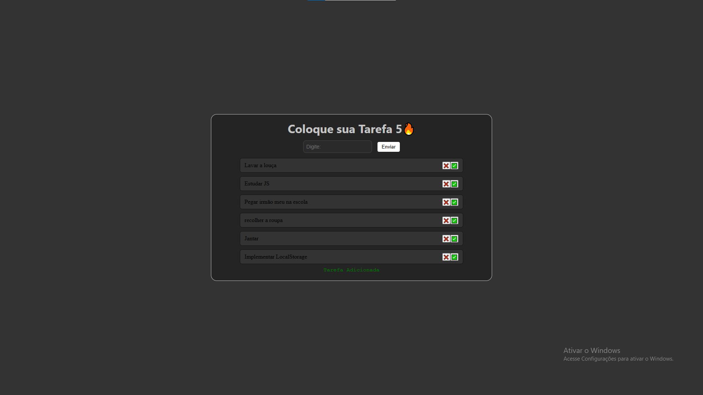

# Lista de Tarefas

Uma aplicaçãp web de Lista de Tarefas, cm persist~encia de dados via LocalStorage, permitindo que a tarefa seja salva, mesmo após recarregar a página.

## Tecnologias:
- HTML
- CSS
- JavaScript

## Funcionalidades:
- Adição de Tarefas
- Remoção de Tarefas
- Uso de LocalStorage

## Como Rodar
1. Clonar repositório: `git clone <url>`
2. Abra aa pasta do projeto
3. Abra o `Index.html` no navegador

## Preview do Sistema

### Tela Principal
